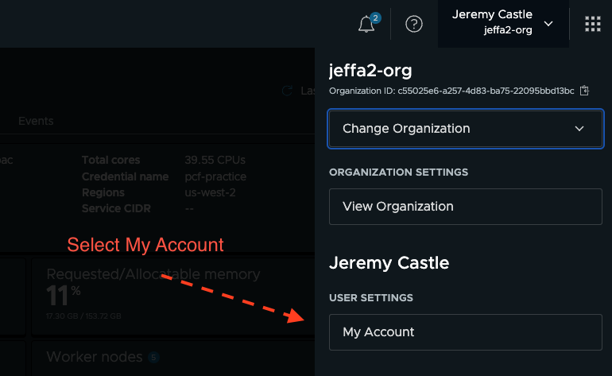
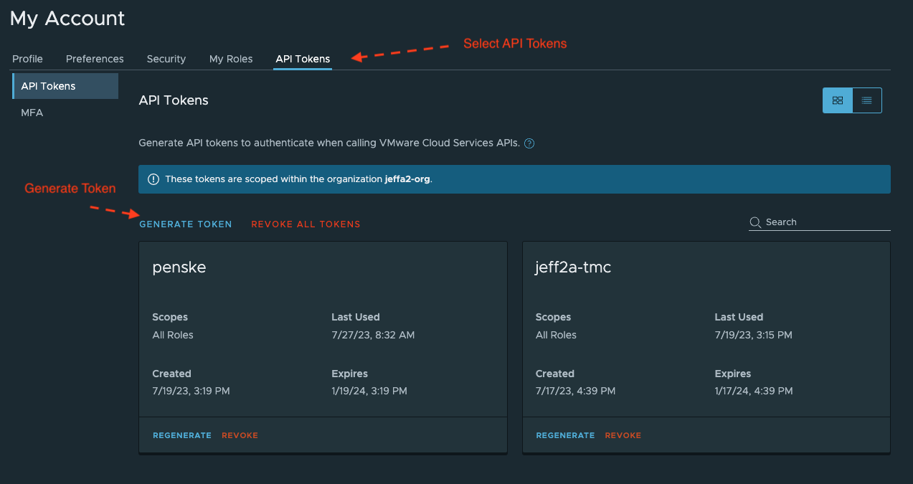
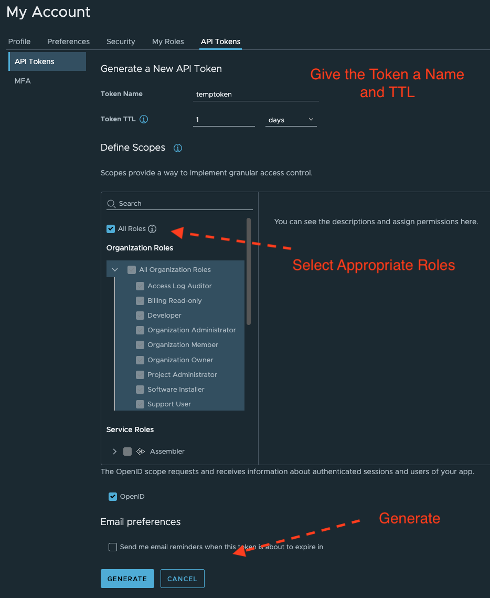
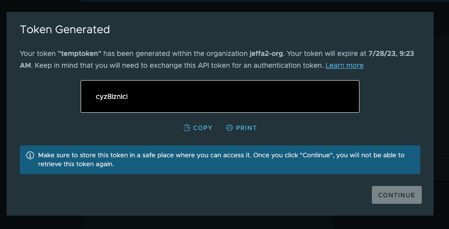

# Getting Started with TAP

This sample catalog and documentation corresponds to a demonstration on how developers can be onboard to a k8s Cluster using TMC and TAP. 

Make sure to follow the [install cli documentation](install-cli.md) before getting starting and that you have access to your [TMC instance](https://jeffa2org.tmc.cloud.vmware.com/).

## Obtain an API Token from TMC









Save your token some place safe!

## Login into TMC and Generate a KubeConfig from Command Line

```
tanzu login --endpoint jeffa2org.tmc.cloud.vmware.com
```

```

 Select a server demo-tmc          (jeffa2org.tmc.cloud.vmware.com:443)

ℹ  If you don't have an API token, visit the VMware Cloud Services console, select your organization, and create an API token with the TMC service roles:
  https://console.cloud.vmware.com/csp/gateway/portal/#/user/tokens

? API Token ****************************************************************

✔  successfully logged into global control plane
ℹ  Checking for required plugins...
ℹ  Installing plugin 'workspace:v0.1.1' with target 'mission-control'
ℹ  Installing plugin 'data-protection:v0.1.1' with target 'mission-control'
ℹ  Installing plugin 'provider-aks-cluster:v0.1.1' with target 'mission-control'
ℹ  Installing plugin 'setting:v0.1.1' with target 'mission-control'
ℹ  Installing plugin 'cluster:v0.1.1' with target 'mission-control'
ℹ  Installing plugin 'iam:v0.1.1' with target 'mission-control'
ℹ  Installing plugin 'ekscluster:v0.1.1' with target 'mission-control'
ℹ  Installing plugin 'events:v0.1.1' with target 'mission-control'
ℹ  Installing plugin 'audit:v0.1.1' with target 'mission-control'
ℹ  Installing plugin 'agentartifacts:v0.1.1' with target 'mission-control'
ℹ  Installing plugin 'helm:v0.1.1' with target 'mission-control'
ℹ  Installing plugin 'inspection:v0.1.1' with target 'mission-control'
ℹ  Installing plugin 'policy:v0.1.1' with target 'mission-control'
ℹ  Installing plugin 'account:v0.1.1' with target 'mission-control'
ℹ  Installing plugin 'secret:v0.1.1' with target 'mission-control'
ℹ  Installing plugin 'tanzupackage:v0.1.1' with target 'mission-control'
ℹ  Installing plugin 'management-cluster:v0.1.1' with target 'mission-control'
ℹ  Installing plugin 'aks-cluster:v0.1.2' with target 'mission-control'
ℹ  Installing plugin 'integration:v0.1.1' with target 'mission-control'
ℹ  Installing plugin 'continuousdelivery:v0.1.1' with target 'mission-control'
ℹ  Installing plugin 'apply:v0.1.1' with target 'mission-control'
ℹ  Installing plugin 'clustergroup:v0.1.1' with target 'mission-control'
ℹ  Installing plugin 'provider-eks-cluster:v0.1.1' with target 'mission-control'

```

Use the Tanzu CLI to generate a kubeconfig:

```
tanzu tmc cluster kubeconfig get eks.pcf-practice.us-west-2.penske-rbac -m eks -p eks > kubeconfig.yaml

```

Test the kubeconfig.yaml 

```
kubectl get namespaces --kubeconfig=kubeconfig.yaml 

```

### Using the Kubeconfig

Merge the kubeconfig into your `.kube/config`:

```
# Make a copy of your existing config 
$ cp ~/.kube/config ~/.kube/config.bak 

# Merge the two config files together into a new config file 
$ KUBECONFIG=~/.kube/config:/path/to/new/config kubectl config view --flatten > /tmp/config 

# Replace your old config with the new merged config 
$ mv /tmp/config ~/.kube/config 

```
